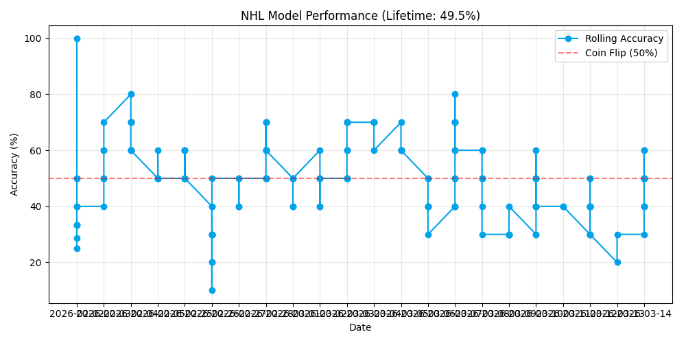

# 🏒 Automated NHL Predictor

This project uses Machine Learning (Random Forest) to predict daily NHL game outcomes. It runs automatically every morning via GitHub Actions.

## 📊 Live Performance

## 🛠️ How It Works
1. **Data Collection:** Fetches live stats from the NHL API.
2. **Backtesting:** Trained on 2,500+ historical games using Walk-Forward Validation.
3. **Automation:** A GitHub Action runs the script daily at 7:00 AM MST.
4. **Self-Correction:** The model retrains itself every day using the latest game results.

## 📂 Files
* `nhl_tracker.py`: The main Python script (ETL + Training + Prediction).
* `nhl_history.csv`: The historical training dataset.
* `nhl_predictions_log.csv`: The daily log of correct/incorrect picks.

## 🤖 Credits & Tools
* **Engine:** Built with Python, Scikit-Learn, and Pandas.
* **Development:** Code developed with the assistance of **Google Gemini**, serving as an AI pair programmer for debugging, optimization, and automation logic.
* **Data Source:** NHL public API.