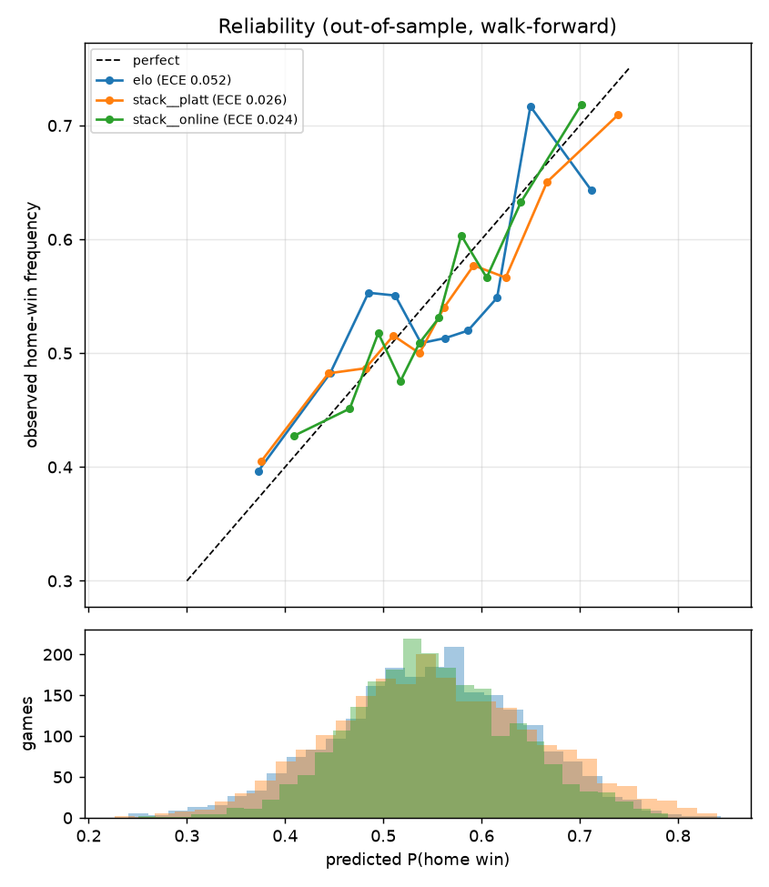

# Walk-forward model comparison

Out-of-sample games: **2624** (2024-10-04 to 2026-04-16), regular season only.
Retrained every 14 days on strictly earlier games; stackers/calibrators learned from inner
time-series out-of-fold predictions. Features/hyper-parameters chosen on data through 2024-06-30 only.
Baseline for a coin flip: log loss 0.6931, Brier 0.2500.

| model              |         n |   log_loss |   brier |   accuracy |    auc |    ece |   cal_slope |   ll_ci_low |   ll_ci_high |
|:-------------------|----------:|-----------:|--------:|-----------:|-------:|-------:|------------:|------------:|-------------:|
| lgbm_all           | 2624.0000 |     0.6743 |  0.2408 |     0.5777 | 0.5975 | 0.0239 |      1.0505 |      0.6672 |       0.6815 |
| wavg               | 2624.0000 |     0.6750 |  0.2411 |     0.5644 | 0.5954 | 0.0188 |      0.9022 |      0.6666 |       0.6836 |
| lgbm_all__platt    | 2624.0000 |     0.6751 |  0.2411 |     0.5743 | 0.5974 | 0.0242 |      0.8715 |      0.6667 |       0.6835 |
| xgb                | 2624.0000 |     0.6753 |  0.2413 |     0.5701 | 0.5949 | 0.0205 |      0.8332 |      0.6665 |       0.6842 |
| lgbm               | 2624.0000 |     0.6757 |  0.2415 |     0.5671 | 0.5929 | 0.0322 |      0.9809 |      0.6681 |       0.6834 |
| xgb__platt         | 2624.0000 |     0.6758 |  0.2415 |     0.5659 | 0.5953 | 0.0202 |      0.8358 |      0.6667 |       0.6849 |
| wavg__platt        | 2624.0000 |     0.6761 |  0.2416 |     0.5686 | 0.5958 | 0.0252 |      0.7779 |      0.6663 |       0.6862 |
| logistic           | 2624.0000 |     0.6761 |  0.2417 |     0.5686 | 0.5955 | 0.0334 |      0.7866 |      0.6668 |       0.6859 |
| stack              | 2624.0000 |     0.6763 |  0.2417 |     0.5682 | 0.5956 | 0.0302 |      0.7720 |      0.6669 |       0.6863 |
| stack__platt       | 2624.0000 |     0.6764 |  0.2418 |     0.5686 | 0.5956 | 0.0284 |      0.7644 |      0.6669 |       0.6864 |
| logistic__platt    | 2624.0000 |     0.6765 |  0.2418 |     0.5652 | 0.5950 | 0.0286 |      0.7961 |      0.6665 |       0.6867 |
| lgbm__platt        | 2624.0000 |     0.6770 |  0.2420 |     0.5633 | 0.5930 | 0.0269 |      0.7970 |      0.6677 |       0.6864 |
| rf                 | 2624.0000 |     0.6770 |  0.2421 |     0.5678 | 0.5907 | 0.0238 |      0.7673 |      0.6677 |       0.6860 |
| rf__platt          | 2624.0000 |     0.6770 |  0.2421 |     0.5682 | 0.5919 | 0.0259 |      0.7925 |      0.6676 |       0.6862 |
| elo__platt         | 2624.0000 |     0.6793 |  0.2432 |     0.5667 | 0.5823 | 0.0282 |      0.7791 |      0.6710 |       0.6875 |
| elo                | 2624.0000 |     0.6794 |  0.2433 |     0.5598 | 0.5819 | 0.0425 |      0.7586 |      0.6708 |       0.6883 |
| lgbm__isotonic     | 2624.0000 |     0.6798 |  0.2428 |     0.5663 | 0.5913 | 0.0287 |      0.6649 |      0.6684 |       0.6911 |
| logistic__isotonic | 2624.0000 |     0.6801 |  0.2430 |     0.5720 | 0.5941 | 0.0311 |      0.6318 |      0.6694 |       0.6910 |
| stack__isotonic    | 2624.0000 |     0.6820 |  0.2430 |     0.5755 | 0.5956 | 0.0358 |      0.5962 |      0.6707 |       0.6937 |
| elo__isotonic      | 2624.0000 |     0.6821 |  0.2441 |     0.5621 | 0.5798 | 0.0274 |      0.6164 |      0.6727 |       0.6912 |
| wavg__isotonic     | 2624.0000 |     0.6842 |  0.2435 |     0.5675 | 0.5938 | 0.0363 |      0.5651 |      0.6722 |       0.6962 |
| home_rate          | 2624.0000 |     0.6897 |  0.2483 |     0.5423 | 0.4911 | 0.0227 |     -2.0955 |      0.6867 |       0.6926 |
| home_rate__platt   | 2624.0000 |     0.6900 |  0.2484 |     0.5423 | 0.5006 | 0.0241 |      0.0305 |      0.6867 |       0.6931 |

## Paired log-loss differences (first minus second; negative = first is better)

|                               |    diff |   ci_low |   ci_high |   p_a_not_better |
|:------------------------------|--------:|---------:|----------:|-----------------:|
| ('logistic', 'elo')           | -0.0033 |  -0.0094 |    0.0033 |           0.1460 |
| ('logistic', 'home_rate')     | -0.0136 |  -0.0219 |   -0.0049 |           0.0018 |
| ('lgbm', 'elo')               | -0.0037 |  -0.0088 |    0.0016 |           0.0865 |
| ('lgbm', 'home_rate')         | -0.0140 |  -0.0209 |   -0.0071 |           0.0003 |
| ('xgb', 'elo')                | -0.0041 |  -0.0098 |    0.0019 |           0.0862 |
| ('xgb', 'home_rate')          | -0.0144 |  -0.0226 |   -0.0063 |           0.0005 |
| ('rf', 'elo')                 | -0.0024 |  -0.0084 |    0.0038 |           0.2190 |
| ('rf', 'home_rate')           | -0.0127 |  -0.0210 |   -0.0042 |           0.0013 |
| ('stack', 'elo')              | -0.0031 |  -0.0080 |    0.0020 |           0.1158 |
| ('stack', 'home_rate')        | -0.0134 |  -0.0221 |   -0.0046 |           0.0013 |
| ('wavg', 'elo')               | -0.0045 |  -0.0087 |   -0.0000 |           0.0248 |
| ('wavg', 'home_rate')         | -0.0147 |  -0.0221 |   -0.0071 |           0.0003 |
| ('stack__platt', 'elo')       | -0.0030 |  -0.0079 |    0.0022 |           0.1255 |
| ('stack__platt', 'home_rate') | -0.0133 |  -0.0221 |   -0.0044 |           0.0015 |
| ('wavg__platt', 'elo')        | -0.0033 |  -0.0085 |    0.0020 |           0.1100 |
| ('wavg__platt', 'home_rate')  | -0.0136 |  -0.0226 |   -0.0045 |           0.0013 |
| ('elo', 'home_rate')          | -0.0103 |  -0.0175 |   -0.0030 |           0.0030 |

## With online calibration (same games for every column, n=2264)

| model            |         n |   log_loss |   brier |   accuracy |    auc |    ece |   cal_slope |
|:-----------------|----------:|-----------:|--------:|-----------:|-------:|-------:|------------:|
| wavg             | 2264.0000 |     0.6757 |  0.2415 |     0.5618 | 0.5919 | 0.0244 |      0.8784 |
| stack__online    | 2264.0000 |     0.6764 |  0.2418 |     0.5676 | 0.5913 | 0.0238 |      0.9554 |
| wavg__online     | 2264.0000 |     0.6765 |  0.2418 |     0.5658 | 0.5913 | 0.0215 |      0.8497 |
| logistic__online | 2264.0000 |     0.6768 |  0.2420 |     0.5636 | 0.5925 | 0.0266 |      0.8398 |
| xgb__online      | 2264.0000 |     0.6768 |  0.2420 |     0.5640 | 0.5902 | 0.0236 |      0.8302 |
| stack            | 2264.0000 |     0.6769 |  0.2420 |     0.5654 | 0.5923 | 0.0249 |      0.7777 |
| stack__platt     | 2264.0000 |     0.6770 |  0.2421 |     0.5658 | 0.5923 | 0.0255 |      0.7706 |
| logistic         | 2264.0000 |     0.6770 |  0.2421 |     0.5671 | 0.5931 | 0.0414 |      0.7652 |
| lgbm__online     | 2264.0000 |     0.6775 |  0.2423 |     0.5649 | 0.5891 | 0.0242 |      0.8326 |
| rf__online       | 2264.0000 |     0.6776 |  0.2424 |     0.5645 | 0.5869 | 0.0295 |      0.8207 |
| elo__online      | 2264.0000 |     0.6799 |  0.2435 |     0.5618 | 0.5760 | 0.0326 |      0.8303 |
| elo              | 2264.0000 |     0.6802 |  0.2436 |     0.5574 | 0.5776 | 0.0516 |      0.7313 |
| home_rate        | 2264.0000 |     0.6896 |  0.2482 |     0.5433 | 0.4890 | 0.0257 |     -2.6628 |

Paired: `stack__online` vs others

|                                   |    diff |   ci_low |   ci_high |   p_a_not_better |
|:----------------------------------|--------:|---------:|----------:|-----------------:|
| ('stack__online', 'elo')          | -0.0038 |  -0.0086 |    0.0014 |           0.0737 |
| ('stack__online', 'elo__online')  | -0.0034 |  -0.0075 |    0.0009 |           0.0597 |
| ('stack__online', 'home_rate')    | -0.0131 |  -0.0195 |   -0.0066 |           0.0005 |
| ('stack__online', 'stack__platt') | -0.0005 |  -0.0024 |    0.0013 |           0.2888 |

`cal_slope` < 1 means over-confident, > 1 under-confident. ECE = expected calibration error (10 quantile bins).

